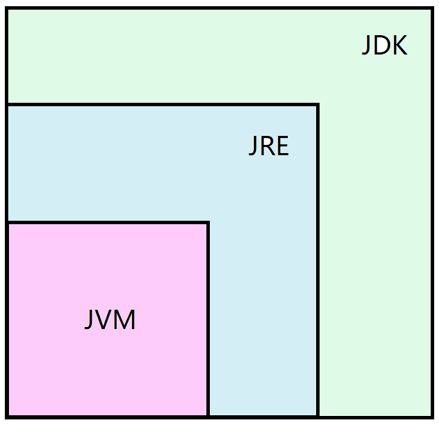
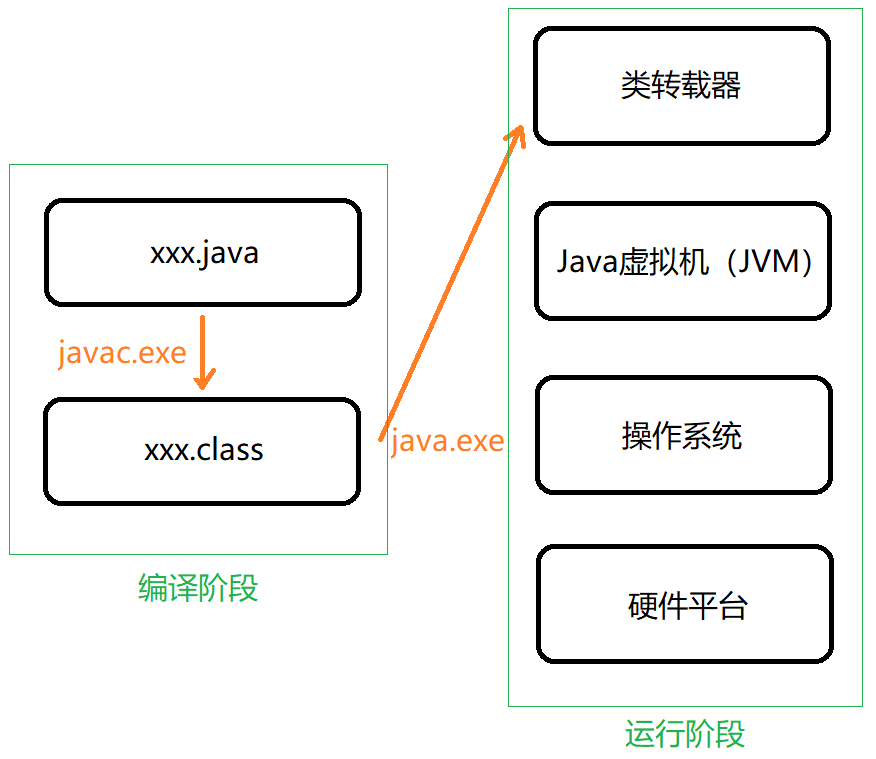
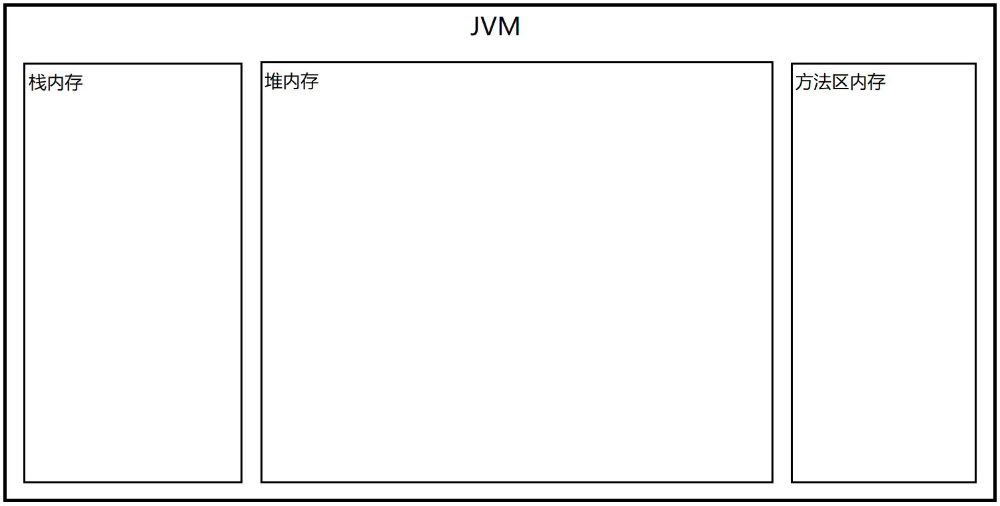
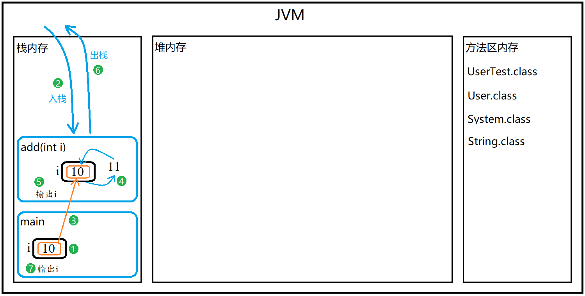
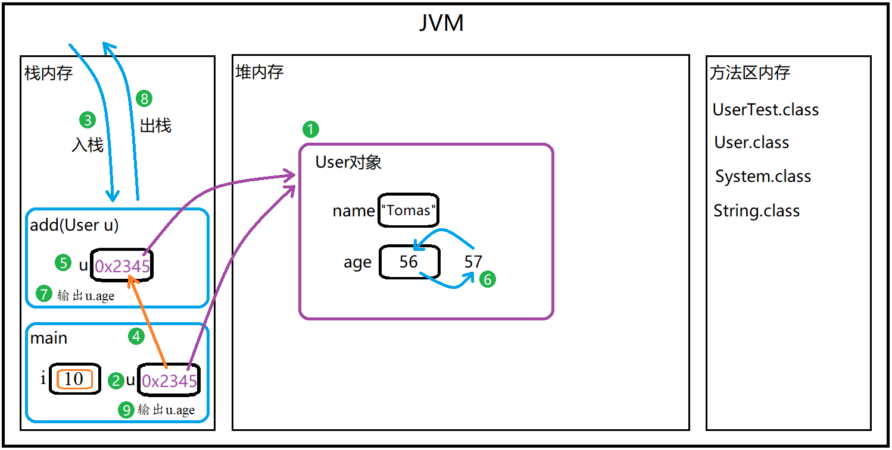

# JavaLearning
---

- JDK、JRE和JVM三者之间的关系-[详细内容](./HelloWorld.java)。  

    

- Java 编译与运行过程-[详细内容](./HelloWorld.java)。  

    

- JVM中的内存划分在[方法运行原理](./MethodMemery.java)中首次提到。  

    

- 参数传递过程在[对象方法](./UserTest.java)中提到。

    
    
传递字面值

    
    
传递对象地址

- 代码测试方式  
  
   1）编译：  
  `javac -encoding utf8 -d .` + `代码(相对)路径`。  
  如：`javac -encoding utf8 -d . ./src/datatype/*.java`  

   2）运行：
   `java ` + `包名` + `类名`。  
   如：`java datatype.BoolTest`、`java datatype.CharTest`
